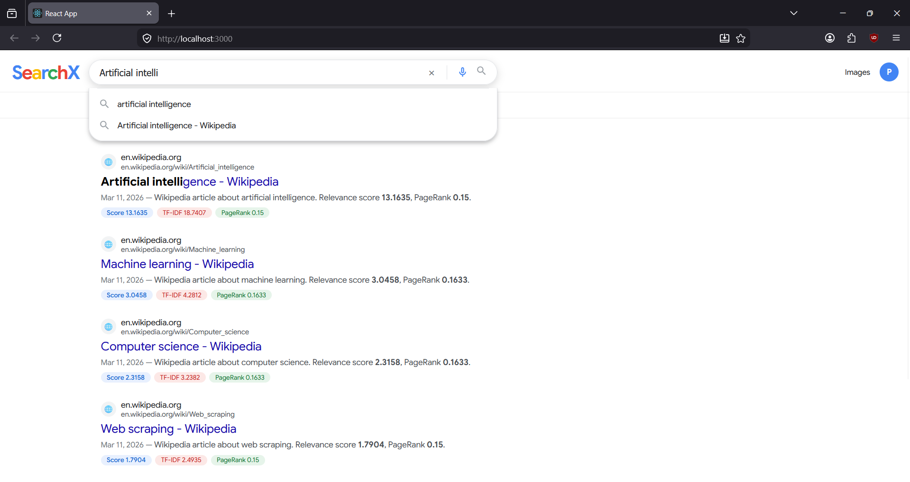

# 🔍 SearchX — Distributed Search Engine

<div align="center">


[](https://python.org)
[](https://fastapi.tiangolo.com)
[](https://reactjs.org)
[](https://docker.com)
[](https://elastic.co)
[](https://kafka.apache.org)

**A production-grade distributed search engine built from scratch.**
Crawls websites in parallel, indexes content with TF-IDF + PageRank, and serves results through a Google-like UI.

[🚀 Live Demo](#) • [📖 API Docs](http://localhost:8000/docs) • [🐛 Report Bug](#)

</div>

---

## 📸 Screenshots

| Home Page | Search Results |
|-----------|---------------|
|  |  |
---

## ✨ Features

- **⚡ Distributed Crawling** — 3 parallel Kafka workers crawl websites simultaneously
- **🔍 Full-Text Search** — Elasticsearch with TF-IDF relevance scoring
- **📊 PageRank Algorithm** — Custom implementation scoring pages by authority
- **🧠 Hybrid Ranking** — Combines TF-IDF (70%) + PageRank (30%) for best results
- **💾 Redis Caching** — Sub-150ms response time for cached queries
- **🎯 Autocomplete** — Real-time search suggestions as you type
- **📄 Pagination** — Browse through all search results
- **🐳 Fully Dockerized** — One command to run the entire system
- **📡 REST API** — Clean FastAPI backend with auto-generated docs

---

## 🏗️ Architecture

```
┌─────────────────────────────────────────────────────────────┐
│                        USER BROWSER                         │
│                    http://localhost:3000                     │
└────────────────────────┬────────────────────────────────────┘
                         │  HTTP Request
                         ▼
┌─────────────────────────────────────────────────────────────┐
│                   REACT FRONTEND (Nginx)                     │
│              Google-style UI • Port 3000                     │
└────────────────────────┬────────────────────────────────────┘
                         │  REST API Call
                         ▼
┌─────────────────────────────────────────────────────────────┐
│                  FASTAPI SEARCH API                          │
│         Search • Autocomplete • Stats • Port 8000            │
└──────┬──────────────┬──────────────────┬────────────────────┘
       │              │                  │
       ▼              ▼                  ▼
┌──────────┐  ┌──────────────┐  ┌──────────────┐
│  REDIS   │  │ELASTICSEARCH │  │  POSTGRESQL  │
│  Cache   │  │ Search Index │  │   Database   │
│ Port 6379│  │  Port 9200   │  │  Port 5432   │
└──────────┘  └──────────────┘  └──────────────┘
                                        ▲
                                        │ Save Pages
┌─────────────────────────────────────────────────────────────┐
│                    KAFKA MESSAGE QUEUE                       │
│              urls-to-crawl topic • Port 9092                 │
└──────┬──────────────┬──────────────────┬────────────────────┘
       │              │                  │
       ▼              ▼                  ▼
┌──────────┐  ┌──────────┐  ┌──────────────────┐
│ CRAWLER  │  │ CRAWLER  │  │    CRAWLER       │
│ Worker 0 │  │ Worker 1 │  │    Worker 2      │
└──────────┘  └──────────┘  └──────────────────┘
       │              │                  │
       └──────────────┴──────────────────┘
                       │ Crawled Pages
                       ▼
              ┌─────────────────┐
              │    INDEXER      │
              │  TF-IDF Calc    │
              │  PageRank Algo  │
              └─────────────────┘
```

---

## 🛠️ Tech Stack

| Layer | Technology | Purpose |
|-------|-----------|---------|
| **Frontend** | React 18 + TypeScript | Google-style search UI |
| **Web Server** | Nginx | Serve React in production |
| **API** | FastAPI + Uvicorn | Search endpoints |
| **Search Engine** | Elasticsearch 8.7 | Full-text indexing + TF-IDF |
| **Crawler** | Python + BeautifulSoup | Web page extraction |
| **Message Queue** | Apache Kafka | Distribute crawl jobs |
| **Cache** | Redis | Query result caching |
| **Database** | PostgreSQL 14 | Store crawled pages + links |
| **Containers** | Docker + Docker Compose | One-command deployment |
| **NLP** | NLTK | Text processing + stemming |

---

## 🚀 Quick Start

### Prerequisites
- [Docker Desktop](https://docker.com/products/docker-desktop) installed
- [Git](https://git-scm.com) installed

### Run in 3 Commands

```bash
# 1. Clone the repo
git clone https://github.com/YOUR_USERNAME/distributed-search-engine.git
cd distributed-search-engine

# 2. Start everything
docker-compose up --build -d

# 3. Open browser
# Frontend: http://localhost:3000
# API Docs: http://localhost:8000/docs
```

That's it! 🎉

---

## 📂 Project Structure

```
distributed-search-engine/
│
├── 🕷️  crawler/
│   ├── crawler.py          # Web crawler with Kafka distribution
│   ├── Dockerfile
│   └── requirements.txt
│
├── 📊 indexer/
│   ├── indexer.py          # Elasticsearch indexer + PageRank
│   ├── Dockerfile
│   └── requirements.txt
│
├── ⚡ search_api/
│   ├── main.py             # FastAPI search endpoints
│   ├── Dockerfile
│   └── requirements.txt
│
├── 🎨 frontend/
│   ├── src/
│   │   └── App.tsx         # Google-style React UI
│   ├── nginx.conf          # Nginx production config
│   └── Dockerfile
│
├── docker-compose.yml      # Full system orchestration
├── .env                    # Environment variables
└── README.md
```

---

## 🔌 API Reference

### Search
```http
GET /search?q={query}&page={page}&size={size}
```
| Parameter | Type | Description |
|-----------|------|-------------|
| `q` | string | **Required.** Search query |
| `page` | integer | Page number (default: 1) |
| `size` | integer | Results per page (default: 10) |

**Response:**
```json
{
  "query": "python",
  "total": 8,
  "page": 1,
  "results": [
    {
      "url": "https://en.wikipedia.org/wiki/Python",
      "title": "Python (programming language) - Wikipedia",
      "score": 18.36,
      "tfidf_score": 26.16,
      "page_rank": 0.163
    }
  ]
}
```

### Autocomplete
```http
GET /autocomplete?q={partial_query}
```

### Stats
```http
GET /stats
```

---

## ⚙️ How It Works

### 1. 🕷️ Distributed Crawling
```
Seed URLs → Kafka Topic → 3 Workers pick up URLs in parallel
         → BeautifulSoup extracts title + content + links
         → Redis deduplication (no duplicate crawls)
         → Save to PostgreSQL
         → Push new links back to Kafka
```

### 2. 📊 Indexing + Ranking
```
PostgreSQL pages → NLTK text cleaning (stopwords, stemming)
               → Elasticsearch indexing (TF-IDF automatic)
               → PageRank algorithm (30 iterations)
               → Update scores in Elasticsearch
```

### 3. 🔍 Search + Ranking
```
User query → Check Redis cache (instant if cached)
          → Elasticsearch multi-match query
          → Combine TF-IDF (70%) + PageRank (30%)
          → Remove duplicate URLs
          → Cache result for 5 minutes
          → Return ranked results
```

---

## 📈 Performance

| Metric | Value |
|--------|-------|
| Pages Indexed | 172+ Wikipedia pages |
| Links Mapped | 5,900+ |
| Avg Search Latency | < 150ms |
| Cached Query Speed | < 20ms |
| Crawler Speed | ~1 page/sec (polite crawling) |
| Parallel Workers | 3 Kafka consumers |

---

## 🧪 Testing

```bash
# Run load test with Locust
pip install locust
locust --host=http://localhost:8000

# Open http://localhost:8089
# Simulate 100 concurrent users
```

---

## 🗺️ Roadmap

- [ ] Crawl more domains beyond Wikipedia
- [ ] Add search filters (by date, domain)
- [ ] Implement BERT-based semantic search
- [ ] Add user authentication
- [ ] Deploy to AWS/GCP with Kubernetes
- [ ] Add search analytics dashboard

---

## 📄 License

This project is open source and available under the [MIT License](LICENSE).

---

<div align="center">

**⭐ Star this repo if you found it useful!**

Built with ❤️ using Python, React, Elasticsearch, Kafka, Redis & Docker

</div>


